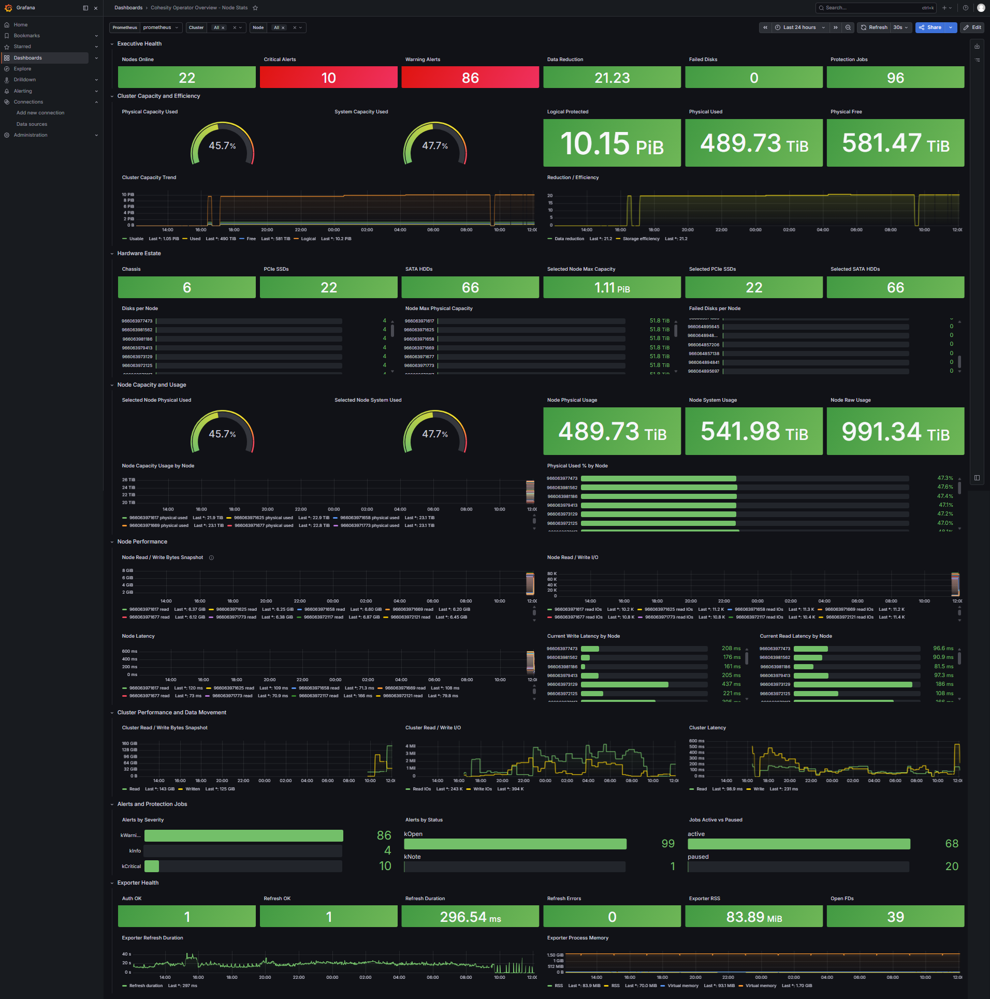

# cohesity-prometheus-exporter
A metrics collector that exports metrics from your local Cohesity cluster and outputs them in a format that can be ingested by Prometheus

## Overview

Use metrics from the Cohesity REST API to export relevant metrics to Prometheus

Install the Grafana dashboard by importing the JSON file `cohesity_grafana_dashboard.json`.



## Installation

Build and run with Docker:

```
docker build -t cohesity-prometheus-exporter .

docker run -d \
    -p 1234:1234 \
    -e PUID=1000 \
    -e PGID=1000 \
    -e COHESITY_VIP=LocalCohesityVIP.domain.com \
    -e COHESITY_USER=YourLogin \
    -e CPE_STATS_ENABLED=1 \
    -e CPE_ENABLE_NODE_DETAIL=1 \
    -e CPE_NODE_DETAIL_REFRESH_SECONDS=120 \
    --name cpe \
    ghcr.io/teebee-camx/cohesity-prometheus-exporter:latest \
    -d local \
    -pwd 'Sup3rS3cr3t' \
    -port 1234
```

Fetch metrics:

```
curl http://CohesityCollector:1234/metrics
```

> Note: Metrics are fetched in a background worker after an initial scrape,
> since Cohesity can be slow to respond.
> Continue polling the `/metrics` endpoint until metrics are returned.

## Usage

```
docker pull ghcr.io/teebee-camx/cohesity-prometheus-exporter:<version>
```

## Prometheus.yml config

Add the following configuration to your prometheus.yml file to start scraping.

```
  - job_name: 'Cohesity exporter'
    static_configs:
      - targets: ['cohesity_exporter:1234']
    metrics_path: /metrics
```
